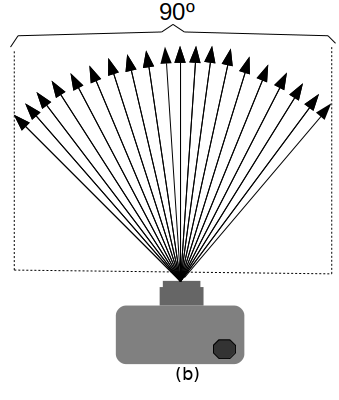
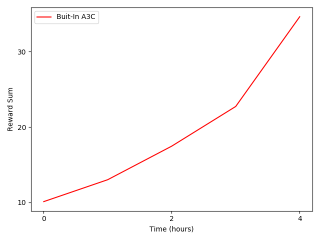
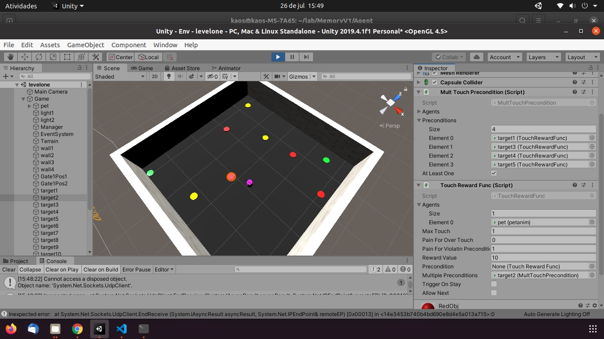

# A Memory Challenge to Reinforcement Learning Algorithms.

This is a simple but challenging game for reinforcement learning algorithms. An agent needs to touch objects of the same color. This means that the agent needs to remember the first object that was touched. The objective of this environment is to verify if reinforcement learning agents are able to learn tasks that require the memorization of past actions.

# Action Space

* Discret (gym)
* 0: forward
* 1: turn right
* 2: turn left
* 3: Idle

# State Space

User can define an observation_space. In our model, **1** images with **20 x 20** pixels is generated by casting rays from the agent's eye position. For this, one uses asymmetrical frustum with a 90-degree aperture angle, as shown in the next figure. The distance from the eye to the image plane is **d**.

Agent's implementation uses as input sequences of **4** frames from the model view.

Therefore, spacte state is a Box with the shape **20x20x4**.

# Agent Implementation

Folder **Agent** contains the a3c_agent.py and ppo2_agent.py examples. The next image shows the training progress using the example a3c_agent.py.

# Environment Implementation
Environment Unity Project is in **Env** folder. The next figure shows same images this environment.

